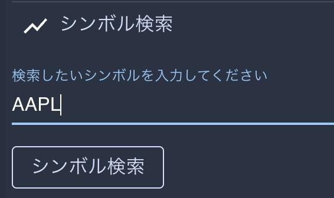

# 【米国株】決算チャート分析から始める米国株分析サイト

## どんなサイト? → 個人投資家向け米国株式の決算・株価分析サイトです。

  

[デプロイ版はこちら](https://www.stocksnstitti.com/) \
  ※テスト用  ID: testman@gmail.com、password: Password1

## 使用している技術スタック
* インフラ: heroku、AWS(S3)
* バックエンド: Ruby on Rails 6.1 (Ruby 3.0.1)
  [※バックエンドのレポジトリはこちら](https://github.com/titti-008/app_211028_stock_sns_backend)
* フロントエンド: React.js 17.0、 TypeScript 4.4.4
* http通信ライブラリー: [axios](https://www.npmjs.com/package/axios)
* UIライブラリー: [Material UI](https://mui.com/)
* 株式情報API: [Financial Modeling Prep API](https://site.financialmodelingprep.com/developer/docs)

## 主な機能
### * 全米国株式(NASDAQ,NYSE)のシンボル検索機能
\

### * 気になる株式をフォローすると、一覧でその日の株価変動が見える
\

### * 各株式の決算データならびに株価チャートを同時系列で表示・分析できる

\
\

### * クローズドな米国株専用SNS
  

### * スマートフォンでもネイティブアプリのような感覚で使用できます(レスポンシブル対応済み)
\

### ローカルサーバー起動方法: `yarn start`

Runs the app in the development mode.\
Open [http://localhost:3000](http://localhost:3000) to view it in the browser.

